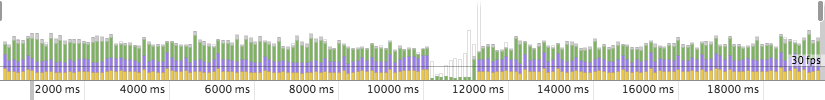
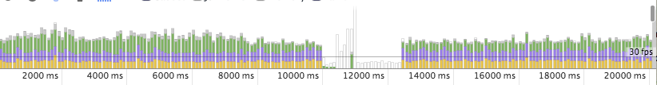
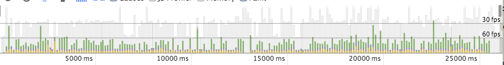
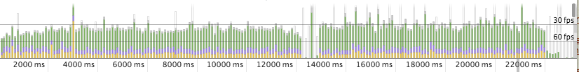
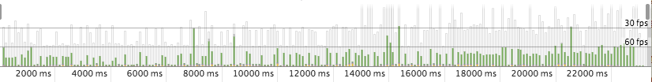
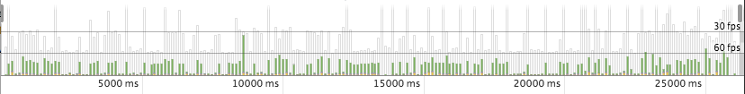
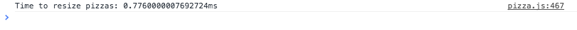

#Website Optimization

######Project Overview

Project #4 of Udacity's [Front-End Web Developer Nanodegree](https://www.udacity.com/course/front-end-web-developer-nanodegree--nd001). The task was to optimize a provided website with a number of optimization and performance-related issues so that it achieves a target PageSpeed score and runs at 60 frames per second.

##Getting Started

######Live

Point your browser to http://optimization.mikejoyce.io

######Locally

**1.** Clone this repo:

```
$ git clone https://github.com/mikejoyceio/website-optimization
````

**2.** Serve the website:

```
$ python -m SimpleHTTPServer
```

Detailed Python Simple Server instructions can been found [here](https://docs.python.org/2/library/basehttpserver.html).

**3.** Open the website:

```
$ open "http://localhost:8000"
```

##File Structure

######app/

Contains development CSS, JS and images, sorted into corresponding directories.

######public/

Contains the production ready CSS, JS and images built from the app/ directory.

######views/

Contains the HTML for the pizza and individual project pages.

##The Build

The [Brunch](http://brunch.io) HTML5 build tool is used to concatenate and minify scripts and style sheets in this project.

######Install Brunch

```
$ npm install -g brunch
```

######Develop

```
$ brunch watch --server
```

######Build

```
$ brunch build --production
```

Detailed documentation can be found [here](https://github.com/brunch/brunch/tree/stable/docs).

##Optimization

###Index Page

The index page originally had a Google PageSpeed score of 35/100 for mobile and 47/100 for desktop. After making changes the score increased to [99/100](https://developers.google.com/speed/pagespeed/insights/?url=http%3A%2F%2Foptimization.mikejoyce.io) for both mobile and desktop. Interestingly enough, the only thing that is preventing a score of 100/100 is Google's own analytics script.

The following changes were made:

######CSS

[Inlined](https://developers.google.com/speed/pagespeed/module/filter-css-inline) all of the CSS into the head of the document and added the HTML [media="print"](https://developer.mozilla.org/de/docs/Web/HTML/Element/link) attribute to the external style sheet link for print styles.

######JS

Added the [HTML async attribute](https://developer.mozilla.org/en-US/docs/Games/Techniques/Async_scripts) to all script tags and used the [Brunch](http://brunch.io/) build tool to concatenate and minify.

######Images

Resized images that were too large and compressed all images with the [Kraken](https://kraken.io/web-interface) image compression tool.

######Gzip compression

Enabled the [mod_deflate](http://httpd.apache.org/docs/2.2/mod/mod_deflate.html) (gzip) Apache module on the server.

######Browser Caching

Leveraged [browser caching](https://developers.google.com/speed/docs/insights/LeverageBrowserCaching) by including an [.htaccess](http://httpd.apache.org/docs/2.2/howto/htaccess.html) file in the root of the website. The file contains expires headers, which sets long expiration times for all CSS, JavaScript and images.

###Sliding Pizzas

The following changes where made to fix the low FPS and produce a consistent 60FPS frame rate when scrolling the page:

######Fixed Typo

Renamed the mis-named 'noise' value in the global adjectives array literal to ‘noisy’ to match the switch case ‘noisy’ in the getAdj function.

```js
var adjectives = ["dark", "color", "whimsical", "shiny", "noisy", "apocalyptic", "insulting", "praise", "scientific"];`
```

######Optimized Loops

Optimized the loops contained in the updatePositions function and the onDOMContentLoaded event handler.

```js
function updatePositions() {
  frame++;
  window.performance.mark("mark_start_frame");

  var items = document.querySelectorAll('.mover');
  for (var i = items.length; i--;) {
    var phase = Math.sin((document.body.scrollTop / 1250) + (i % 5));
    items[i].style.left = items[i].basicLeft + 100 * phase + 'px';
  }

  // User Timing API to the rescue again. Seriously, it's worth learning.
  // Super easy to create custom metrics.
  window.performance.mark("mark_end_frame");
  window.performance.measure("measure_frame_duration", "mark_start_frame", "mark_end_frame");
  if (frame % 10 === 0) {
    var timesToUpdatePosition = window.performance.getEntriesByName("measure_frame_duration");
    logAverageFrame(timesToUpdatePosition);
  }
}
```

```js
document.addEventListener('DOMContentLoaded', function() {
  var cols = 8;
  var s = 256;
  for (var i = 200; i--;) {
    var elem = document.createElement('img');
    elem.className = 'mover';
    elem.src = "../public/img/pizza.png";
    elem.style.height = "100px";
    elem.style.width = "73.333px";
    elem.basicLeft = (i % cols) * s;
    elem.style.top = (Math.floor(i / cols) * s) + 'px';
    document.querySelector("#movingPizzas1").appendChild(elem);
  }
  updatePositions();
});
```

######Reduced Pizza Elements

Reduced the amount of sliding pizza elements generated from 200 down to 31, which still sufficiently fills the screen with sliding pizzas.

```js
document.addEventListener('DOMContentLoaded', function() {
  var cols = 8;
  var s = 256;
  for (var i = 31; i--;) {
    var elem = document.createElement('img');
    elem.className = 'mover';
    elem.src = "../public/img/pizza.png";
    elem.style.height = "100px";
    elem.style.width = "73.333px";
    elem.basicLeft = (i % cols) * s;
    elem.style.top = (Math.floor(i / cols) * s) + 'px';
    document.querySelector("#movingPizzas1").appendChild(elem);
  }
  updatePositions();
});
```

######Improved CSS Animation Performance

Applied translateX() and translateZ(0) transform functions to the sliding pizza elements within the updatePositions function.


```js
function updatePositions() {
  frame++;
  window.performance.mark("mark_start_frame");

  var items = document.querySelectorAll('.mover');
  for (var i = items.length; i--;) {
    var phase = Math.sin((document.body.scrollTop / 1250) + (i % 5));
    //items[i].style.left = items[i].basicLeft + 100 * phase + 'px';
    var left = -items[i].basicLeft + 1000 * phase + 'px';
 		items[i].style.transform = "translateX("+left+") translateZ(0)";
  }

  // User Timing API to the rescue again. Seriously, it's worth learning.
  // Super easy to create custom metrics.
  window.performance.mark("mark_end_frame");
  window.performance.measure("measure_frame_duration", "mark_start_frame", "mark_end_frame");
  if (frame % 10 === 0) {
    var timesToUpdatePosition = window.performance.getEntriesByName("measure_frame_duration");
    logAverageFrame(timesToUpdatePosition);
  }
}
```

######Improved Efficiency

Moved the calculation which utilizes the scrollTop method outside of the loop.

```js
function updatePositions() {
  frame++;
  window.performance.mark("mark_start_frame");

  var items = document.querySelectorAll('.mover');
  var top = (document.body.scrollTop / 1250);

  for (var i = items.length; i--;) {
    var phase = Math.sin( top + (i % 5));
    //items[i].style.left = items[i].basicLeft + 100 * phase + 'px';
    var left = -items[i].basicLeft + 1000 * phase + 'px';
 		items[i].style.transform = "translateX("+left+") translateZ(0)";
  }

  // User Timing API to the rescue again. Seriously, it's worth learning.
  // Super easy to create custom metrics.
  window.performance.mark("mark_end_frame");
  window.performance.measure("measure_frame_duration", "mark_start_frame", "mark_end_frame");
  if (frame % 10 === 0) {
    var timesToUpdatePosition = window.performance.getEntriesByName("measure_frame_duration");
    logAverageFrame(timesToUpdatePosition);
  }
}
```

######Reduced Browser Paint Events

Removed height and width styles from the generated pizza elements and resized the pizza image to 100 x 100 to prevent the browser from having to resize the images.

```js
document.addEventListener('DOMContentLoaded', function() {
  var cols = 8;
  var s = 256;
  for (var i = 31; i--;) {
    var elem = document.createElement('img');
    elem.className = 'mover';
    elem.src = "../public/img/pizza-slider.png";
    elem.basicLeft = (i % cols) * s;
    elem.style.top = (Math.floor(i / cols) * s) + 'px';
    document.querySelector("#movingPizzas1").appendChild(elem);
  }
  updatePositions();
});
```

######Optimized Animations

Added the updatePositions function as a parameter to the window.requestAnimationFrame method in the scroll event listener which optimizes concurrent animations together into a single reflow and repaint cycle.

```js
window.addEventListener('scroll', function() {
	window.requestAnimationFrame(updatePositions);
});
```

###Resized Pizzas

The following changes were made to resize the pizzas in under 5ms:

######Improved Efficiency

Moved the determineDx function call inside the changePizzaSizes function out of the loop. Selected only the first .randomPizzaContainer in the document.

```js
function changePizzaSizes(size) {
	var dx = determineDx(document.querySelector(".randomPizzaContainer"), size);
  for (var i = 0; i < document.querySelectorAll(".randomPizzaContainer").length; i++) {
    var newwidth = (document.querySelectorAll(".randomPizzaContainer")[i].offsetWidth + dx) + 'px';
    document.querySelectorAll(".randomPizzaContainer")[i].style.width = newwidth;
  }
}
```

Moved the newwidth calculation inside the changePizzaSizes function out of the loop. Again, selected only the first .randomPizzaContainer element in the document.

```js
function changePizzaSizes(size) {
	var dx = determineDx(document.querySelector(".randomPizzaContainer"), size);
	var newwidth = (document.querySelector(".randomPizzaContainer").offsetWidth + dx) + 'px';
  for (var i = 0; i < document.querySelectorAll(".randomPizzaContainer").length; i++) {
    document.querySelectorAll(".randomPizzaContainer")[i].style.width = newwidth;
  }
}
```

Created a new variable to hold all of the .randomPizzaContainer elements in the document and looped through the elements to apply the new width value.

```js
function changePizzaSizes(size) {
	var dx = determineDx(document.querySelector(".randomPizzaContainer"), size);
	var newwidth = (document.querySelector(".randomPizzaContainer").offsetWidth + dx) + 'px';
	var elements = document.querySelectorAll(".randomPizzaContainer");
  for (var i = 0; i < elements.length; i++) {
    elements[i].style.width = newwidth;
  }
}
```

######Optimized Loops

Optimized loop inside the changePizzaSizes function.

```js
function changePizzaSizes(size) {
	var dx = determineDx(document.querySelector(".randomPizzaContainer"), size);
	var newwidth = (document.querySelector(".randomPizzaContainer").offsetWidth + dx) + 'px';
	var elements = document.querySelectorAll(".randomPizzaContainer");
  for (var i = elements.length; i--;) {
    elements[i].style.width = newwidth;
  }
}
```

##Optimization Breakdown (tl;dr)

###Index Page

######Google PageSpeed Score before any fixes


######Google PageSpeed Score after fixes



###Sliding Pizzas

######FPS Before any fixes



######After fixing mis-named adjectives array literal value


######After optimizing loops



######After reducing the number of sliding pizzas generated from 200 to 31



######After applying translateX() and translateZ(0) transform functions to the sliding pizza elements



######After moving a calculation utlizing the scrollTop property outside of a loop



######After removing height & width styles from pizza image tag and resizing the image


######After including window.requestAnimationFrame method within scroll event handler


###Resized Pizzas

######Resize time before fixes


######Resize time after fixes




##Resources


####Index Page


######Critical Fold CSS

- [CSS-Tricks: Authoring Critical Above-the-Fold CSS](http://css-tricks.com/authoring-critical-fold-css/)

######CSS Optimization

- [Google Developers: Optimize CSS Delivery](https://developers.google.com/speed/docs/insights/OptimizeCSSDelivery#example)
- [Gift of Speed: Lazy Load CSS](http://www.giftofspeed.com/defer-loading-css/)
- [Gift of Speed: Inline CSS](http://www.giftofspeed.com/inline-your-css-code/)
- [Critical Path CSS Generator](http://jonassebastianohlsson.com/criticalpathcssgenerator/) By Jonas Ohlsson
- [Loading CSS Asynchronously](http://deanhume.com/home/blogpost/loading-css-asynchronously/7104) By Dean Hume

######CSS Media Queries

- [CSS Tricks: CSS Media Queries & Using Available Space](http://css-tricks.com/css-media-queries/)

######Build Tools

- [Brunch HTML5 Build Tool](http://brunch.io/)
- [Brunch Dead Simple Skeleton](https://github.com/brunch/dead-simple)
- [Minify your final CSS file using Gulp.js](http://alfanso.com/minify-your-final-css-file-using-gulp-js/) By Ashit Vora
- [Compressing your Images using Gulp.js](http://alfanso.com/compressing-your-images-using-gulp-js/) By Ashit Vora
- [Introduction to Gulp.js with practical examples](http://julienrenaux.fr/2014/05/25/introduction-to-gulp-js-with-practical-examples/) By Julien Renaux
- [Grunt vs Gulp vs Brunch](http://blog.toggl.com/2014/03/grunt-vs-gulp-vs-brunch/) By Andrin Riiet

######Image Optimization

- [Yahoo! Smush.it](http://www.smushit.com/ysmush.it/)
- [Kraken.io Optimizer](https://kraken.io/web-interface)

######JavaScript Execution

- [Asynchronous and deferred JavaScript execution explained](http://peter.sh/experiments/asynchronous-and-deferred-javascript-execution-explained/) By Peter Beverloo
- [CSS Tricks: Async Attribute and Scripts At The Bottom](http://css-tricks.com/async-attribute-scripts-bottom/)

######Webfonts

- [WOFF - Web Open Font Format Browser Support](http://caniuse.com/#feat=woff)

######GZIP Compression

- [Enable GZIP compression in WHM / cPanel with EasyApache](http://myhosting.com/kb/index.php?action=showEntry&data=4906)
- [Enable Apache Gzip Compression (mod_deflate) Globally in WHM/cPanel](http://tecadmin.net/enable-apache-gzip-compression-globally-in-whm-cpanel/)
- [How to check if mod_delate in enabled](http://stackoverflow.com/questions/970151/how-to-check-mod-deflate-is-enabled-in-apache)
- [Check GZIP Compression](http://checkgzipcompression.com/)

######HTTP Caching

- [Google Developers: Cache Control](https://developers.google.com/web/fundamentals/performance/optimizing-content-efficiency/http-caching)
- [5 .htaccess Snippets to Borrow from HTML5 Boilerplate](http://davidwalsh.name/html5-boilerplate-htaccess) By David Walsh


####Pizza Page


######Layout & Rendering

- [Jank Free](http://jankfree.org/)
- [Gone In 60 Frames Per Second: A Pinterest Paint Performance Case Study](http://www.smashingmagazine.com/2013/06/10/pinterest-paint-performance-case-study/) By Addy Osmani
- [[VIDEO] Gone in 60fps - Making A Site Jank-Free](http://addyosmani.com/blog/making-a-site-jank-free/) By Addy Osmani

######JavaScript Loop

- [Loop iteration performance](http://stackoverflow.com/questions/3520688/javascript-loop-performance-why-is-to-decrement-the-iterator-toward-0-faster-t)

######JavaScript Switch

- [Switch statement performance](http://stackoverflow.com/questions/18830626/should-i-use-big-switch-statements-in-javascript-without-performance-problems)
- [Switch vs. if else](http://stackoverflow.com/questions/2922948/javascript-switch-vs-if-else-if-else)
- [Writing efficient JavaScript](http://archive.oreilly.com/pub/a/server-administration/excerpts/even-faster-websites/writing-efficient-javascript.html)
- [O'Reilly JavaScript - The Definitive Guide - Switch](http://archive.oreilly.com/pub/a/server-administration/excerpts/even-faster-websites/writing-efficient-javascript.html)

######JavaScript DOM Traversal

- [Mozilla Developer Network: document.querySelector](https://developer.mozilla.org/en-US/docs/Web/API/document.querySelector)
- [Mozilla Developer Network: document.querySelectorAll](https://developer.mozilla.org/en/docs/Web/API/Document.querySelectorAll)

######CSS Transform

- [CSS Tricks - Transform](http://css-tricks.com/almanac/properties/t/transform/)
- [Treehouse: Increase Your Site’s Performance with Hardware-Accelerated CSS](http://blog.teamtreehouse.com/increase-your-sites-performance-with-hardware-accelerated-css)
- [Force Hardware Acceleration in WebKit with translate3d](http://davidwalsh.name/translate3d) By David Walsh

######Animations

- [HTML5 Rocks: High Performance Animations](http://www.html5rocks.com/en/tutorials/speed/high-performance-animations/) By Paul Lewis and Paul Irish

######requestAnimationFrame

- [Fixing a parallax scrolling website to run in 60 FPS](http://kristerkari.github.io/adventures-in-webkit-land/blog/2013/08/30/fixing-a-parallax-scrolling-website-to-run-in-60-fps/) By Krister Kari
- [Mozilla Developer Network: window.requestAnimationFrame](https://developer.mozilla.org/en-US/docs/Web/API/window.requestAnimationFrame)

######Chrome Devtools

- [Cheatsheet](http://anti-code.com/devtools-cheatsheet/)
- [Performance profiling with the Timeline](https://developer.chrome.com/devtools/docs/timeline)

######Chrome Office Hours

- [[VIDEO] Paul Lewis & Paul Irish investigate rendering problems](https://www.youtube.com/watch?v=z0_jD8nO5Zw)

######Udacity Office Hours

- [[VIDEO] Office Hours: P3 and P4, Strategies for Web Optimization](https://plus.google.com/events/cjk2bief153ofdink5eln6nv8f8)